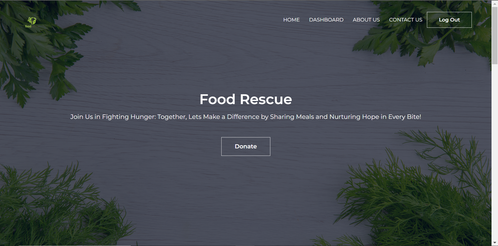
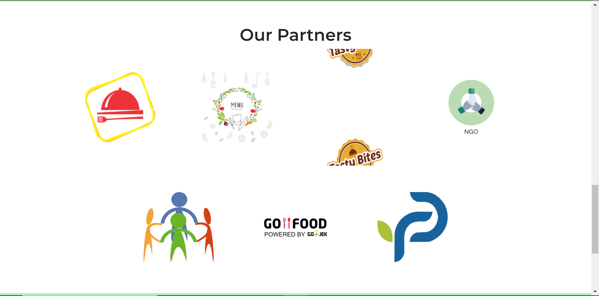
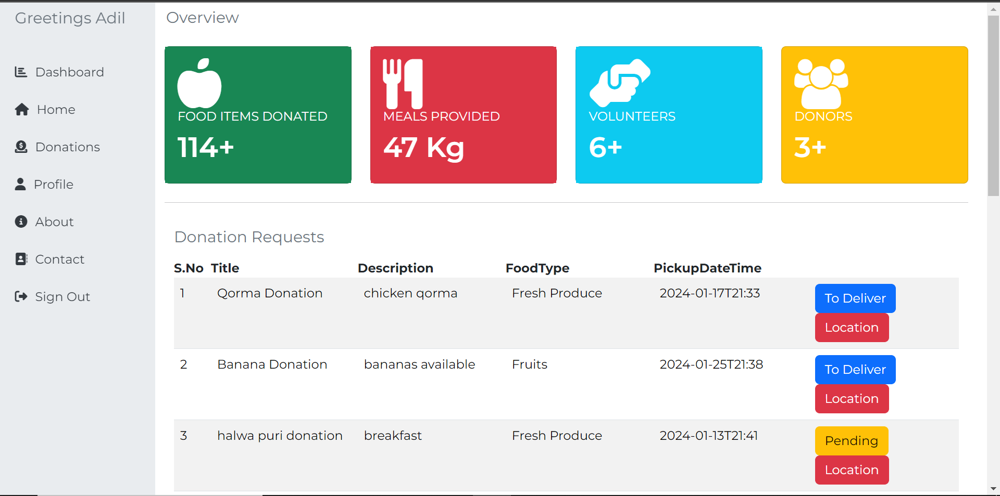
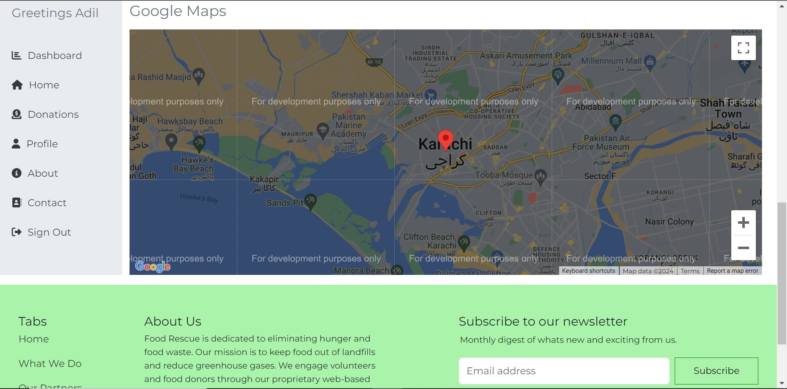
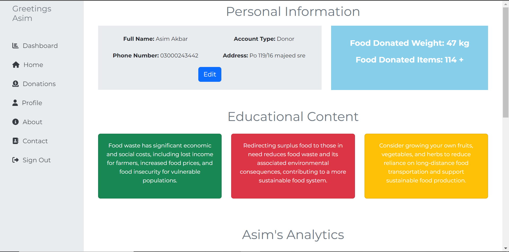
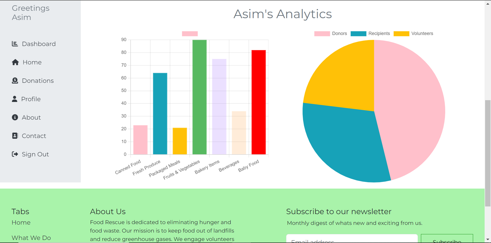
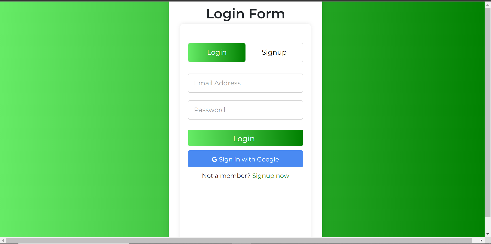
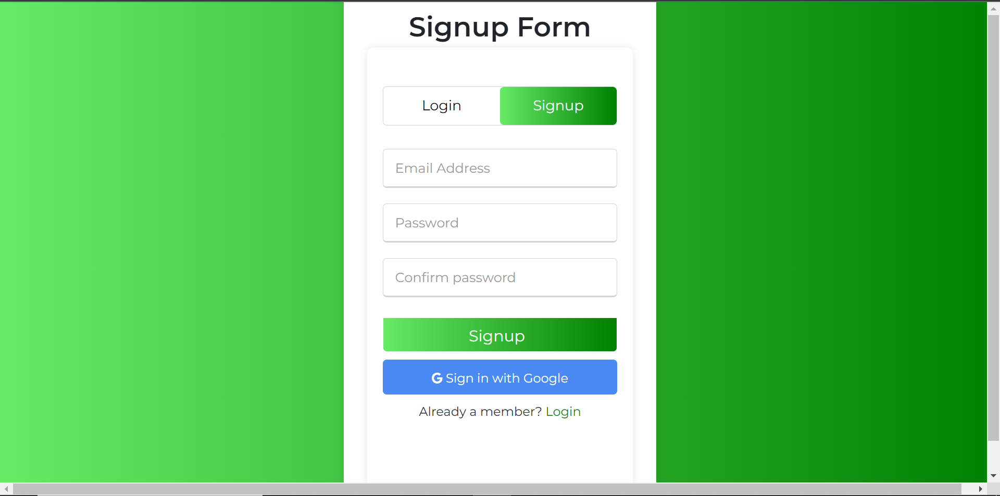
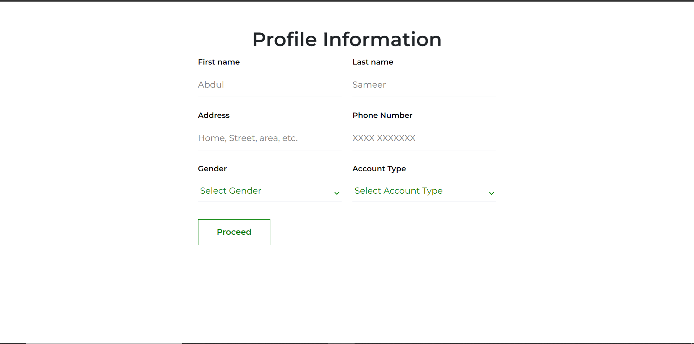
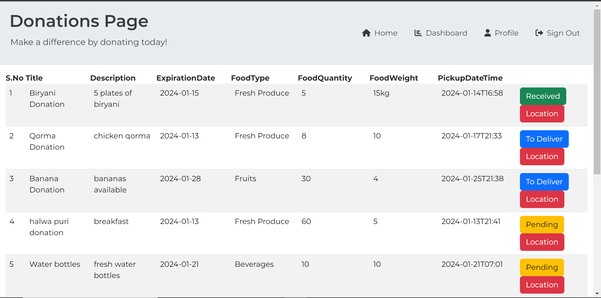

# FoodShare

The FoodShare platform is designed to provide a seamless digital interface for restaurants, grocery stores, and individuals to donate surplus food to local shelters or individuals in need. By doing so, this initiative aims to reduce food wastage while fostering a sense of community responsibility and support. The platform connects donors, recipients, and volunteers to ensure efficient and effective management of food resources.

## Table of Contents

- [Introduction](#introduction)
- [Features](#features)
- [Prerequisites](#prerequisites)
- [Installation](#installation)
- [Configuration](#configuration)
- [Usage](#usage)
- [Components](#components)
- [Interfaces](#interfaces)
- [Contributing](#contributing)

## Introduction

Food Donation Platform aims to address the issue of food waste by providing a centralized system for managing food donations. It caters to donors, recipients, and volunteers, offering a seamless experience for food donation, distribution, and delivery.

## Features
- **User Authentication:** Utilizes Firebase for user authentication, ensuring secure access to the platform.
- **Real-time Donation Tracking:** Firebase Realtime Database is employed to track and manage real-time food donations.
- **User Roles:** Donors, recipients, and volunteers each have a dedicated interface tailored to their specific needs.
- **Analytics:** Users can view detailed analytics of their food-related activities, including donation and delivery statistics.
- **Google Maps Integration:** The Google Maps feature provides a visual representation of geographical locations. It displays the selected location for donation or delivery, making it easy to track and manage these activities.Users can view the map on the Donation Page and on dashboard to enhance location-related interactions.
- **Educational Content:** The platform includes educational content to raise awareness about the impact of food waste and sustainable practices.
- **Metrics Dashboard:** A metrics dashboard displays key metrics, such as the number of volunteers, donors, food items donated, meals provided, and geographical distribution using Google Maps. The dashboard provides a comprehensive overview of the platform's impact and efficiency.


## Prerequisites

Ensure the following prerequisites are installed before running the application:

- Node.js
- Firebase (configured with appropriate credentials)

## Installation

Clone the repository and install dependencies:

```bash
git clone https://github.com/zeeshanibrarali/FoodShare
cd FoodShare
cd mern
npm install
cd client
npm install
```

## Configuration
Configure Firebase:

- Create a Firebase project: Firebase Console
- Set up authentication and real-time database in Firebase.
- Update Firebase configuration in the project.

## Usage

After setting up your firebase configurations, and forking the repository.

To run the Application
```bash
npm start
```
Open your browser and go to http://localhost:3000.

## Components

### Dashboard Component
The Dashboard component in FoodShare serves as the main interface for authenticated users. It includes features such as real-time metrics, a request listing, and an integrated Google Maps view.

### Donation Component
The Donation component in FoodShare handles the display of donation requests. It provides features for donors, volunteers, and recipients to interact with and manage incoming donation requests. The component is dynamic, adapting its features based on the user's role and the context in which it is used.

### Profile Component
The Profile component in FoodShare is responsible for displaying user analytics, including personal information, food donation and receipt statistics, and educational content. This component utilizes charts to represent data and provides users with insights into their contributions and activities within the FoodShare platform.

## Interfaces

### Home
<table>
 <tr> 
    <td></td>
    <td></td>
  </tr>
</table>

### Desktop 

<table>
 <tr> 
    <td></td>
    <td></td>
  </tr>
</table>

### Profile

<table>
 <tr> 
    <td></td>
    <td></td>
  </tr>
</table>

### Authentication

<table>
 <tr> 
    <td></td>
    <td></td>
  </tr>
</table>

### Personal Info Page/Donation Page

<table>
 <tr> 
    <td></td>
    <td></td>
  </tr>
</table>

## Authors

- **Zeeshan Ibrar:** Firebase Auth, Firebase Realtime Database, Googles Map Api (backend)
- **Abdul Haseeb Alam:** React.js (Frontend)

## Contributing
We welcome contributions from the community! To contribute to the FoodShare project, please follow these guidelines:

- Fork the repository.
- Create a new branch: **git checkout -b feature/your-feature.**
- Commit your changes: **git commit -m 'Add a new feature'.**
- Push to the branch: **git push origin feature/your-feature.**
- Submit a pull request.


